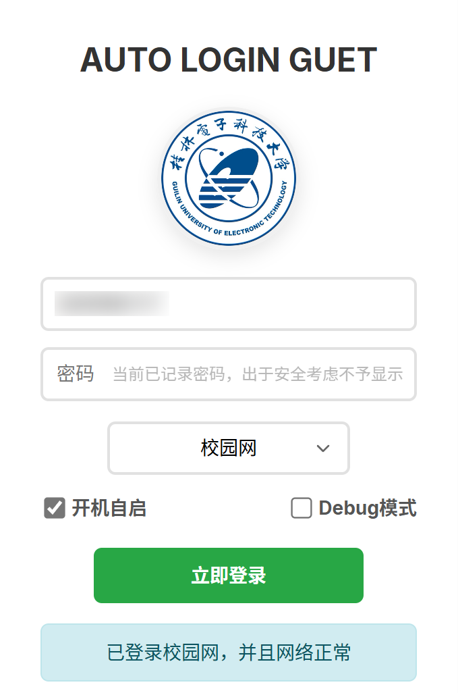
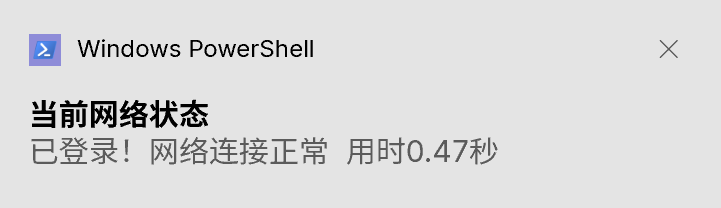
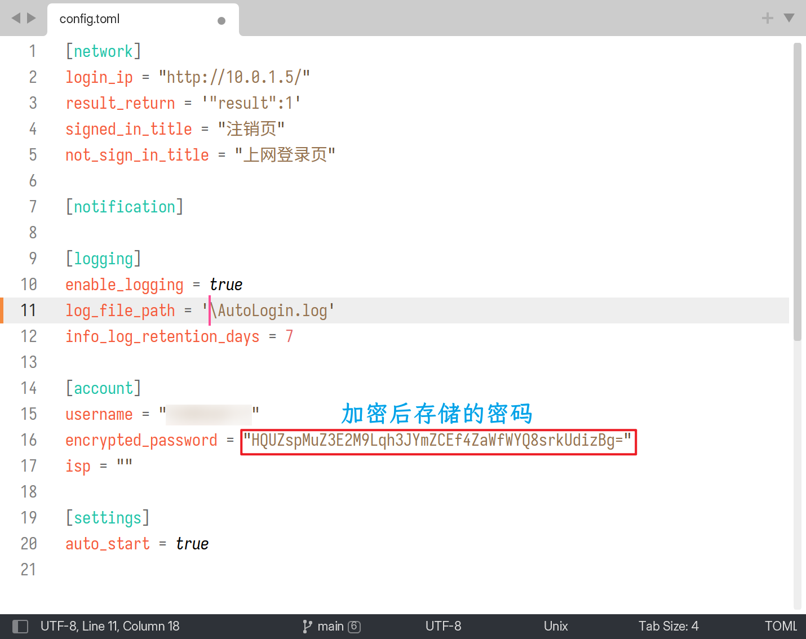

# [<?xml version="1.0" encoding="UTF-8"?><svg width="30" height="30" viewBox="0 0 50 50" fill="none" xmlns="http://www.w3.org/2000/svg"><path d="M31 4H16L10 27H18L14 44L40 16H28L31 4Z" fill="none" stroke="#333" stroke-width="4" stroke-linecap="round" stroke-linejoin="round"/><path d="M21 11L19 19" stroke="#333" stroke-width="4" stroke-linecap="round"/></svg>AutoLoginGUET](AutoLoginGUET)


[](https://www.microsoft.com/zh-cn/windows)
[](LICENSE)


**本项目用以解决 GUET 校园网有线连接需要频繁认证的问题**

> [!NOTE]
>
> 校园网无感知认证对无线用户已足够友好
>
> 但**有线用户**每天重新开机后仍需**重复输入**登录信息
>
> **AutoLoginGUET 因此而生，让有线也能“无感”上网**

## 功能特性

- 🚀 **自动登录**: 短生命周期，单次执行即退出
- 🖥️ **图形界面**: 提供直观易用的图形界面
- 🔕 **静默模式**: 也可无窗口静默启动
- 🔐 **密码加密**: 使用 AES 加密存储用户密码

> [!TIP]
> 项目现已添加[mini_script](mini_script])脚本目录，包含基本的登录和通知功能
> 
> 为**有经验**的三端(Win、Unix)用户提供**超轻量级**选择

## 示意图



***



***



## 安装

### 下载安装程序

- 从 [Releases](https://github.com/ReRokutosei/AutoLoginGuet/releases/) 页面下载（`AutoLoginGUET-*-installer.exe`）
- 运行安装程序，按照提示完成安装

> [!IMPORTANT]
> 前端依赖 WebView2，Win10 以后的版本（除企业版）基本内置了 Edge 浏览器，无需手动安装
>
> 如果曾经卸载过相关组件，请前往[微软 WebView2 官网](https://developer.microsoft.com/zh-cn/microsoft-edge/webview2/)下载安装

## 使用方法

### GUI 模式

直接双击 `AutoLoginGUET` 启动：

1. 输入学号和密码
2. 选择网络运营商
3. 点击"开机自启"
4. 点击"立即登录"

### 静默模式

使用 `-silent` 参数启动静默登录模式：

```bash
.\AutoLoginGUET.exe -silent
```

> [!TIP] 
>
> 在静默模式下，程序不会显示前端图形窗口
>
> 设定开机自启后，程序会自动添加`-silent`

- 静默模式执行以下流程： 
  1. 读取配置
  2. 检查网络
  3. 自动登录
  4. 显示通知


## 自行编译

### 参考文档

[API 文档](docs/API.md)

### 项目结构

```
src/
├── core/
│   ├── config.rs        # 配置管理
│   ├── config_manager.rs # 配置管理器
│   ├── crypto.rs        # 密码加密解密
│   ├── logging.rs       # 日志管理
│   ├── mod.rs           # 模块声明
│   ├── network.rs       # 网络请求
│   └── notification.rs  # 系统通知
├── gui/
│   ├── app.rs           # 主应用逻辑
│   ├── components.rs    # 界面组件
│   ├── debug.rs         # 调试模块
│   └── mod.rs           # 模块声明
└── main.rs              # 程序入口
```

### 从源码编译

```bash
git clone https://github.com/ReRokutosei/AutoLoginGuet.git
cd AutoLoginGuet
cargo build --release
```

构建后的可执行文件位于 `target/release/AutoLoginGUET.exe`

## 许可证

本项目采用 [GPLv3](LICENSE) 许可证

## 其他

- 参考文章[(理论上)各大高校都适用的 全平台校园网自动登录实现方法](https://www.bilibili.com/opus/646733491161006112) **by[HWinZnieJ](https://github.com/Winnie0408)**
- 图标资源来自 **[IconPark](https://github.com/bytedance/IconPark)**，遵循 [Apache-2.0](docs/LICENSE-ICONPARK.md) 许可
- GUET 徽标来自[学校官网](https://www.guet.edu.cn/2023/1013/c6376a109340/page.htm)
- [Inno Setup 简体中文版翻译文件](installer\chinese.isl)来自 **[项目Inno-Setup-Chinese-Simplified-Translation](https://github.com/kira-96/Inno-Setup-Chinese-Simplified-Translation)**，遵循 MIT 许可

## 免责声明
> [!CAUTION]
> 
> **本工具仅供学习交流使用，使用者需自行承担使用风险**
> 
> **开发者不对因使用本工具造成的任何损失负责**