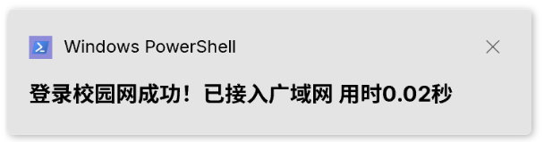
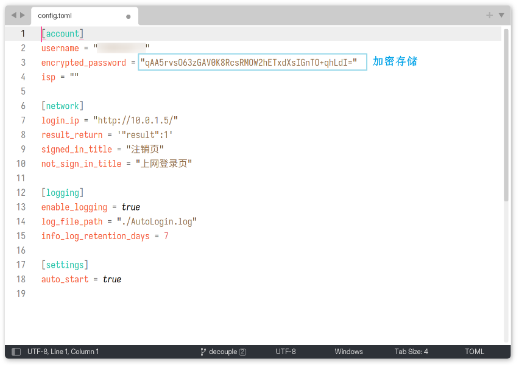

# ⚡AutoLoginGUET


[](https://www.microsoft.com/zh-cn/windows)
[](LICENSE)
[](https://github.com/ReRokutosei/AutoLoginGuet/actions/workflows/release.yml)


🎓 校园网无感知认证对无线用户已足够友好

🔌 **有线用户**每天重新开机后仍需**重复输入**登录信息

🎯 AutoLoginGUET 因此而生，让有线也能**无感**上网

## 🌟 功能特性

- 🚀 **自动登录**: 短生命周期，单次执行即退出
- 🖥️ **图形界面**: 提供直观易用的图形界面
- 👻 **静默模式**: 也可无窗口静默启动
- 🔐 **加密存储**: 使用 AES 加密存储用户密码

> [!TIP]
> 📦 项目现已添加 [mini_script](mini_script) 脚本目录，仅包含基本的登录和通知功能
> 
> 🛠️ 为**有经验**的三端(Win、Unix)用户提供**超轻量级**选择

## 📺 示意图


***



***



## 📦 安装

### 📥 下载安装程序

- 从 [Releases](https://github.com/ReRokutosei/AutoLoginGuet/releases/) 页面下载（`AutoLoginGUET-*-installer.exe`）
- 运行安装程序，按照提示完成安装

> [!IMPORTANT]
> 🌐 前端依赖 WebView2，Win10 以后的版本（除企业版）基本内置了 Edge 浏览器，无需手动安装
>
> 🔧 如果曾经卸载过相关组件，请前往[微软 WebView2 官网](https://developer.microsoft.com/zh-cn/microsoft-edge/webview2/)下载安装

## 🚀 使用方法

### 📺 GUI模式

直接双击 `AutoLoginGUET` 启动：

1. 🔢 输入学号和密码
2. 🌐 选择网络运营商
3. 🔁 点击"开机自启"
4. ✅ 点击"立即登录"

### 🤫 静默模式

传入 `-silent` 参数启动静默登录模式：

```
./AutoLoginGUET.exe -silent
```

> [!TIP] 
>
> 🙊 在静默模式下，程序不会显示任何窗口
>
> ⚙️ 设定开机自启后，程序会自动添加`-silent`

- 静默模式执行以下流程： 
  1. 📖 读取配置
  2. 🌐 检查网络
  3. 💻 自动登录
  4. 📣 显示通知


## 🔧 自行编译

### 📚 参考文档

- 📖 [API 文档](docs/API.md)
- 📚 使用 `cargo doc` 生成文档

### 🏗️ 从源码编译

```
git clone https://github.com/ReRokutosei/AutoLoginGuet.git
cd AutoLoginGuet
cargo build --release
```

构建后的可执行文件位于：
- `target/release/AutoLoginGUET.exe`

## 📃 许可证

本项目遵循 **GNU General Public License v3.0 (GPLv3)** 开源协议

完整文本见项目根目录 [`LICENSE`](LICENSE) 文件或访问官方页面：  
[https://www.gnu.org/licenses/gpl-3.0.html](https://www.gnu.org/licenses/gpl-3.0.html)

### 🔑 GPLv3 摘要

使用、修改或分发本项目（包括编译生成的软件），即表示你接受以下关键条款（非完整法律文本，仅作提示）：

- ✅ 可自由使用、修改、分发（包括商业用途）  
- 📦 分发时**必须提供完整的源代码**（包括构建脚本与依赖）
- 🔄 所有衍生作品**必须以 GPLv3 协议开源发布**
- 🧩 不得通过技术手段（如加密锁机）阻止用户运行修改版
- 🛑 禁止将本项目或其衍生品用于闭源或专有软件集成
- 📄 必须保留原始版权声明与许可证通知


---

## 📚 第三方资源说明

- 📖 参考文章：[(理论上)各大高校都适用的 全平台校园网自动登录实现方法](https://www.bilibili.com/opus/646733491161006112) —— by [HWinZnieJ](https://github.com/Winnie0408)
- 🎨 图标资源：来自 [IconPark](https://github.com/bytedance/IconPark)，遵循 [Apache-2.0](docs/LICENSE-ICONPARK.md) 许可
- 🏫 GUET 徽标：取自 [桂林电子科技大学官网](https://www.guet.edu.cn/2023/1013/c6376a109340/page.htm)，仅用于标识用途
- 🌐 Inno Setup 简体中文翻译：来自 [Inno-Setup-Chinese-Simplified-Translation](https://github.com/kira-96/Inno-Setup-Chinese-Simplified-Translation)，遵循 MIT 许可

---

## ⚖️ 免责声明

> [!CAUTION]
> 
> **本工具仅供学习与交流使用，任何使用行为均需由使用者自行承担相关风险**
> 
> **开发者明确不对因使用或无法使用本工具所引起的任何直接、间接、特殊或后果性（consequential）损失承担责任**
> 
> ---
> 
> **重要法律声明**
> 
> 使用本项目源代码，或基于其构建、编译、衍生的任何软件，即视为您已充分阅读、理解并自愿接受：
> 
> 1. **GPLv3 协议的全部条款与义务**
> 2. **本声明中的所有免责与限制性内容**
> 
> ---
> 
> **若您不同意上述任一内容，请立即停止使用本项目及其所有衍生作品**