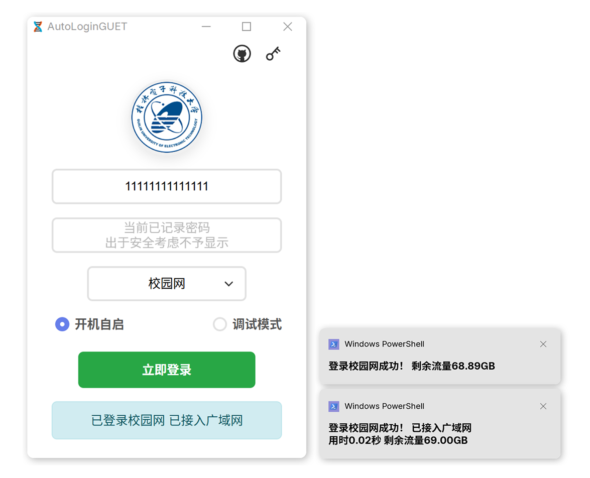

<h1 align="center">
  <br>⚡AutoLoginGUET<br>
</h1>

<p align="center">
    
    &nbsp;
    
    &nbsp;
    
    &nbsp;
    
    &nbsp;
    
    &nbsp;
    
    &nbsp;
    
</p>

## ❓ Q&A

<details>
<summary>Q：这个项目适用于哪些学校？</summary>
<ul><p>⚡ 项目仅适配 <strong>GUET校园网</strong>，其他同为使用哆点供应商方案的学校可以参考</p></ul>
</details>

<details>
<summary>Q：校园网无线和有线有什么区别？</summary>
<ul>
<p>🎓 校园网无线与有线用户均受 300 分钟空闲超时（Idle Timeout）限制</p>
<li><strong>无线 (GUET-WiFi)</strong>: 通过首次 HTTP 请求重定向至认证网关 (<code>10.0.1.5/...?wlanuserip=...&amp;wlanacname=...</code>)，利用动态会话参数完成认证。认证后，后台系统可基于会话状态实现自动重连与状态保持，用户重连通常无需再次手动输入</li>
<li><strong>有线</strong>: 通过访问网关 (<code>10.0.1.5</code>) 并提交表单（通常为 GET 请求，参数在 URL 中，使用 <code>10.0.1.5?DDDDD=账号&amp;upass=密码&amp;...</code>）进行认证。认证状态在超过 300 分钟无网络操作空闲时长（夜间关机至次日），会因超时而失效，需重新认证</li>
</ul>
</details>

<details>
<summary>Q：这个项目解决了什么问题？</summary>
<p>🎯 解决有线用户一天一登录的繁琐操作问题，近似达到无感知认证</p>
</details>

<details>
<summary>Q：这个项目有哪些主要功能？</summary>
<ul>
<li>🚀 <strong>自动登录</strong>: 短生命周期，单次执行即退出</li>
<li>👻 <strong>静默模式</strong>: 在GUI填写信息并勾选开机自启后，将使用无窗口静默执行自动登录</li>
<li>🔐 <strong>加密存储</strong>: 使用 AES 加密存储用户密码</li>
<li>⚗️ <strong>流量查询</strong>: 登录时一并返回另一个用户自助系统的校园网流量信息(可选)</li>
</ul>
</details>

<details>
<summary>Q：为什么不用更轻便的 Python？</summary>
<ul>
<li> Python 脚本需要配置环境且打包体积巨大</li>
<li>Rust 编译体积更小，下载即用，对小白更友好</li>
</ul>
</details>

<details>
<summary>Q：还有没有更轻的选择？</summary>
<ul><p>请见 <a href="mini_script">mini_script</a> 目录</p><ul>
</details>

<details>
<summary>Q：为什么不用C/Cpp/C#？</summary>
<ul><p>菜</p></ul>
</details>


## 📺 示意图



## 📦 安装

### 📥 下载安装程序

- 从 [Releases](https://github.com/ReRokutosei/AutoLoginGuet/releases/) 页面下载（`AutoLoginGUET-*-installer.exe`）
- 运行安装程序，按照提示完成安装

> [!IMPORTANT]
> 🌐 **前端依赖**: Microsoft Edge WebView2 Runtime
>
> 💻 **Windows 10/11 (非企业LTSC)**: 通常已内置，无需手动安装
>
> 🔧 若缺失或曾卸载，请访问 [Microsoft Edge WebView2 官网](https://developer.microsoft.com/en-us/microsoft-edge/webview2/) 下载安装。


## 🚀 使用方法

### 📺 GUI模式

直接双击 `AutoLoginGUET` 启动：

1. 🔢 输入学号和密码
2. 🌐 选择网络运营商
3. 🔁 点击"开机自启"
4. ✅ 点击"立即登录"

### 🤫 静默模式

传入 `-silent` 参数启动静默登录模式：

```
./AutoLoginGUET.exe -silent
```

> [!TIP] 
>
> 🙊 在静默模式下，程序不会显示任何窗口
>
> ⚙️ 设定开机自启后，程序会自动添加`-silent`

- 静默模式执行以下流程： 
  1. 📖 读取配置
  2. 🌐 检查网络
  3. 💻 自动登录
  4. 📣 显示通知

### 📢 消息系统

支持自定义通知、GUI界面和日志内容，使用以下占位符：

- `%1`：校园网状态（`已登录校园网`）
- `%2`：广域网状态（`已接入广域网`）
- `%3`：操作耗时（`用时1.23秒`）
- `%4`：剩余流量（`剩余流量12.34GB`）

####  ⌛ 计时差异

静默模式设定为从程序启动到登录完成的完整时间；GUI模式仅计算当前点击登录的操作耗时

静默模式的总耗时通常会比GUI模式长0.5-1秒左右，属于正常现象

#### 📃 默认配置（`config.toml`）
```
[message]
notify_text = "%1 %2\n%3 %4"
gui_text = "%1 %2"
log_text = "%1 %2 %3 %4"
```

- `notify_text`和`gui_text`支持换行符`\n`和空格

- `log_text`不支持换行符，会自动过滤

- 运营商非`校园网`时，`%4`不会生效

- 每个场景至少传入一个占位符，可按需调整各模板内容

## 🔧 自行编译

### 📚 参考文档

- 📖 [API 文档](docs/API.md)
- 📚 使用 `cargo doc` 生成文档

### 🏗️ 从源码编译

```
git clone https://github.com/ReRokutosei/AutoLoginGuet.git
cd AutoLoginGuet
cargo build --release
```

构建后的可执行文件位于：
- `target/release/AutoLoginGUET.exe`

## 📃 许可证

本项目遵循 **GNU General Public License v3.0 (GPLv3)** 开源协议

完整文本见项目根目录 [`LICENSE`](LICENSE) 文件或访问官方页面：  
[https://www.gnu.org/licenses/gpl-3.0.html](https://www.gnu.org/licenses/gpl-3.0.html)

### 🔑 GPLv3 摘要

使用、修改或分发本项目（包括编译生成的软件），即表示你接受以下关键条款（非完整法律文本，仅作提示）：

- ✅ 可自由使用、修改、分发（包括商业用途）  
- 📦 分发时**必须提供完整的源代码**（包括构建脚本与依赖）
- 🔄 所有衍生作品**必须以 GPLv3 协议开源发布**
- 🧩 不得通过技术手段（如加密锁机）阻止用户运行修改版
- 🛑 禁止将本项目或其衍生品用于闭源或专有软件集成
- 📄 必须保留原始版权声明与许可证通知


---

## 📚 第三方资源说明

- 📖 参考文章：[(理论上)各大高校都适用的 全平台校园网自动登录实现方法](https://www.bilibili.com/opus/646733491161006112) —— by [HWinZnieJ](https://github.com/Winnie0408)
- 🎨 图标资源：来自 [IconPark](https://github.com/bytedance/IconPark)，遵循 [Apache-2.0](docs/LICENSE-ICONPARK.md) 许可
- 🏫 GUET 徽标：取自 [桂林电子科技大学官网](https://www.guet.edu.cn/2023/1013/c6376a109340/page.htm)，仅用于标识用途
- 🌐 Inno Setup 简体中文翻译：来自 [Inno-Setup-Chinese-Simplified-Translation](https://github.com/kira-96/Inno-Setup-Chinese-Simplified-Translation)，遵循 MIT 许可

---

## ⚖️ 免责声明

> [!CAUTION]
> 
> **本工具仅供学习与交流使用，任何使用行为均需由使用者自行承担相关风险**
> 
> **开发者明确不对因使用或无法使用本工具所引起的任何直接、间接、特殊或后果性（consequential）损失承担责任**
> 
> ---
> 
> **重要法律声明**
> 
> 使用本项目源代码，或基于其构建、编译、衍生的任何软件，即视为您已充分阅读、理解并自愿接受：
> 
> 1. **GPLv3 协议的全部条款与义务**
> 2. **本声明中的所有免责与限制性内容**
> 
> ---
> 
> **若您不同意上述任一内容，请立即停止使用本项目及其所有衍生作品**