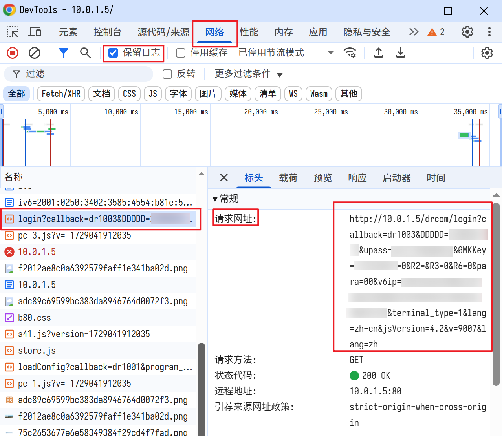

# 自动登录校园网（哆点网络）

[](https://www.python.org/)
[](https://www.rust-lang.org/)
[](https://yaml.org/)
[](https://www.microsoft.com/zh-cn/windows)
[](LICENSE)

## 介绍
理论上该项目适用于供应商为[哆点网络](https://doctorcom.com/)的校园网自动登录。这里只面向GUET的用户，其他学校用户请自行修改配置参数。

**网络请求这部分代码逻辑来自于桂林理工大学的大佬[HWinZnieJ](https://www.bilibili.com/opus/646733491161006112#reply258018351937)。**

对于Python我增加了日志输出，并将配置抽取到YAML文件中。由于Python打包的程序太大，所以使用Rust重写并构建了分发包。

## 功能特性
- ✨ 校园网自动登录
- 📝 支持自定义日志记录
- 🔄 一键配置开机自启动
- ⚙️ YAML 格式配置文件
- 🚀 提供Python和Rust两种实现版本

## 项目结构
```
AutoLoginGuet
│   config.yaml               # 配置参数文件
│
├───Bat脚本                   # 辅助脚本文件夹（用于设置或取消开机自启）
│       Py-设置开机自启-注册表.bat            # Python 版本：通过注册表设置开机自启
│       Py-设置开机自启-计时任务(管理员).bat   # Python 版本：通过计划任务设置开机自启（需管理员权限）
│       Rust-设置开机自启-注册表.bat          # Rust 版本：通过注册表设置开机自启
│       Rust-设置开机自启-计时任务(管理员).bat # Rust 版本：通过计划任务设置开机自启（需管理员权限）
│
├───Python                    # Python 实现版本文件夹
│       AutoLogin.pyw         # Python 源码文件
│       requirements.txt      # Python 依赖包列表
│
└───Rust                      # Rust 实现版本文件夹
    └───Auto_login            # Rust 项目文件夹
        │   Cargo.toml        # Rust 项目配置文件
        │
        ├───resources
        │       Rust.ico      # Rust 程序图标文件
        │
        └───src
                main.rs       # Rust 入口文件
```

## 快速开始

### 配置说明
1. `config.yaml` 需与程序放在同目录
2. 配置文件中只需修改 `sign_parameter` 参数
3. `sign_parameter`参数值获取方法：

    - 打开浏览器，按下F12打开DevTools，选择`网络(network)`，勾选保留日志
    
    - 然后在浏览器地址栏输入校园网登录地址`http://10.0.1.5`，登录你的账号，如果已经登录则需要先退出再重新登录
    
    - 然后在DveTool中查找名称开头为`login?callback=dr1003&DDDDD`的请求包
    
    - `请求网站`的值就是我们要的`sign_parameter`。



### Rust版本使用说明 (推荐）
1. 下载文件
   - [AutoLogin.exe](https://github.com/ReRokutosei/AutoLoginGuet/releases/download/v0.9/AutoLogin.exe)
   - [config.yaml](https://github.com/ReRokutosei/AutoLoginGuet/releases/download/v0.9/config.yaml)

2. 基础使用
   - 将下载的文件放在同一目录
   - 配置 `config.yaml`
   - 运行 `AutoLogin.exe`

3. 开机自启设置
   - 下载并使用 [Rust-设置开机自启-注册表.bat](https://github.com/ReRokutosei/AutoLoginGuet/releases/download/v0.9/Rust_Set_Starup.bat)
   - 如需取消，使用 [Rust-取消开机自启-注册表.bat](https://github.com/ReRokutosei/AutoLoginGuet/releases/download/v0.9/Rust_Cancel_Starup.bat)

### Python版本使用说明
1. 克隆并配置项目
   ```shell
   git clone https://github.com/ReRokutosei/AutoLoginGuet.git
   cd AutoLoginGuet
   xcopy config.yaml .\Python\ /y
   # 接下来按照上面的步骤修改config.yaml

   cd Python
   python -m pip install -r requirements.txt
   ```

2. 测试
   ```shell
   python AutoLogin.pyw
   ```


3. 开机自启设置
   ```sh
   cd Bat脚本
   ./"Py-设置开机自启-注册表.bat"
   ./"Py-取消开机自启-注册表.bat" # 如需取消
   ```

## Rust构建说明
   >~~必要文件都在仓库了，自己编译即可。不想写了~~

如果你希望从源码编译 Rust 版本的程序，请按照以下步骤操作。确保你的系统已经安装了必要的工具链和依赖。

### **环境准备**

1. **安装Rust**  (Windows)

   访问 [Rust 官方安装页面](https://www.rust-lang.org/tools/install)，下载适用于 Windows 的 `.exe` 安装程序，并按照提示完成安装。

   或者，如果你已经配置了 WSL，可以打开 WSL 终端并执行：
   ```sh
   curl --proto '=https' --tlsv1.2 -sSf https://sh.rustup.rs | sh
   ```

3. **克隆项目代码**  
   使用 `git` 克隆项目到本地：
   ```sh
   git clone https://github.com/ReRokutosei/AutoLoginGuet.git
   cd AutoLoginGuet\Rust\Auto_login
   ```


### **编译步骤**

1. **图标文件**  
  图标文件 `Rust.ico` 位于 `Rust/Auto_login/resources/` 目录下，用于生成带有图标的可执行文件。如果需要自定义图标，请替换该文件并重新编译。

2. **检查依赖**  
   ```sh
   cargo check
   ```

3. **构建 Release 版本**  
   使用以下命令编译生成优化后的可执行文件：
   ```sh
   cargo build --release
   ```
   编译完成后，生成的可执行文件将位于 `target/release/` 目录下，文件名为 `AutoLogin.exe`。

4. **验证编译结果**  
   运行生成的可执行文件以验证其功能：
   ```sh
   xcopy /y ..\..\..\config.yaml .\target\release\ # 复制配置文件，记得填写必要参数
   .\target\release\AutoLogin.exe
   ```

## 注意事项

- 仅在Windows 10测试通过，其他系统请自行调试
- 所有脚本文件需与程序放在同目录
- 推荐使用注册表方式设置开机自启
- 请勿将你的配置文件`config.yaml`上传到公共仓库
- 为避免版权问题，不提供icon图标，请自行准备
- Python版本的bat脚本会自动检测安装路径，无需手动配置
- 如果不再使用，取消开机自启后删除配置文件`config.yaml`、程序文件`AutoLogin`和日志文件`AutoLogin.log`即可
