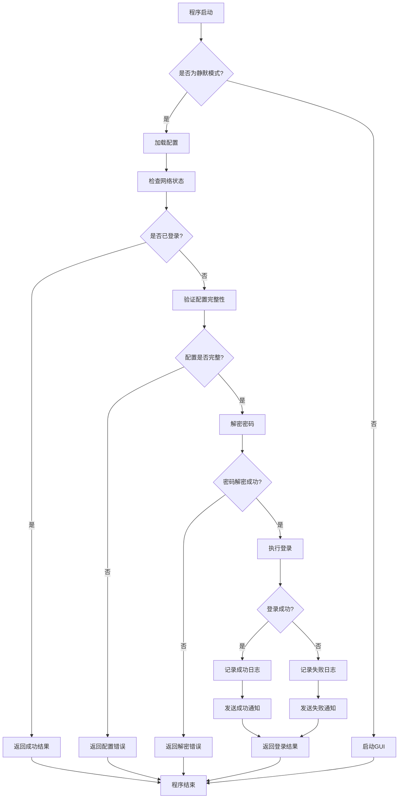
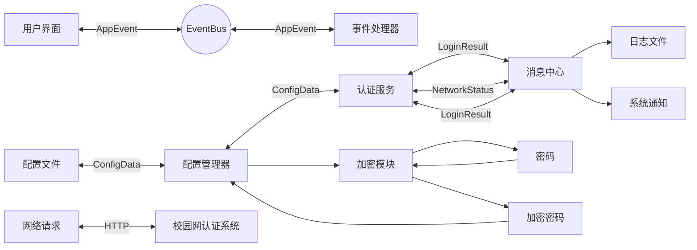

# AutoLoginGUET API 文档

## 项目概述

AutoLoginGUET 是一个用于桂林电子科技大学校园网自动登录的工具。

理论上更改几个参数就可以给其他同样使用哆点网络系统的学校使用

## 核心模块结构

```
src/
├── core/              # 核心功能模块
│   ├── config.rs      # 配置管理
│   ├── crypto.rs      # 密码加密解密
│   ├── dto.rs         # 数据传输对象
│   ├── error.rs       # 错误处理
│   ├── events.rs      # 事件系统
│   ├── message.rs     # 消息处理中心
│   ├── network.rs     # 网络管理
│   └── service.rs     # 服务层（主要API）
├── gui/               # GUI相关代码（仅Windows）
└── lib.rs             # 库导出
```

## 主要API

### AuthService - 认证服务

`AuthService` 是项目的核心API，提供了登录、配置管理、系统设置等主要功能。

#### 创建实例

```rust
use autologinguet_core::{AuthService, load_config};

let config = load_config().unwrap_or_default();
let auth_service = AuthService::new(config);
```

#### 主要方法

##### `silent_login(&self, config: ConfigData) -> AppResult<LoginResult>`

执行静默登录操作。

- **参数**: `config` - 登录配置数据
- **返回**: `LoginResult` - 登录结果
- **用途**: 在后台自动执行登录流程，不显示GUI界面

##### `login_with_credentials(&self, username: &str, password: &str, isp: &str) -> AppResult<LoginResult>`

使用指定凭据执行登录。

- **参数**:
  - `username` - 用户名
  - `password` - 密码
  - `isp` - 运营商
- **返回**: `LoginResult` - 登录结果
- **用途**: 使用特定凭据执行登录

##### `load_config(&self) -> AppResult<ConfigData>`

加载配置文件。

- **返回**: `ConfigData` - 配置数据
- **用途**: 从配置文件加载用户设置

##### `save_config(&self, config: &ConfigData) -> AppResult<()>`

保存配置到文件。

- **参数**: `config` - 要保存的配置数据
- **返回**: `Result` - 操作结果
- **用途**: 将配置数据保存到配置文件

##### `clean_old_logs(&self) -> AppResult<()>`

清理过期日志。

- **返回**: `Result` - 操作结果
- **用途**: 删除超过保留期限的日志文件

##### `set_auto_start(&self, enabled: bool) -> AppResult<()>`

设置开机自启。

- **参数**: `enabled` - 是否启用开机自启
- **返回**: `Result` - 操作结果
- **用途**: 设置或取消程序开机自启（仅Windows平台）

### NetworkManager - 网络管理

负责网络状态检测和登录请求发送。

#### 主要方法

##### `check_network_status(&self) -> AppResult<NetworkStatus>`

检查网络状态。

- **返回**: `NetworkStatus` - 网络状态枚举
- **用途**: 检测当前网络连接状态

##### `attempt_login_with_credentials(&self, username: &str, password: &str, isp: &str) -> AppResult<String>`

尝试使用凭据登录。

- **参数**:
  - `username` - 用户名
  - `password` - 密码
  - `isp` - 运营商
- **返回**: `String` - 服务器响应内容
- **用途**: 发送登录请求到校园网认证系统

### MessageCenter - 消息中心

负责日志记录、通知显示和消息格式化。

#### 主要方法

##### `handle_login_result(&self, result: LoginResult) -> LoginResult`

处理登录结果并发送相关通知。

- **参数**: `result` - 登录结果
- **返回**: `LoginResult` - 处理后的登录结果
- **用途**: 记录日志、显示通知并触发事件

##### `log_event(&self, level: &str, message: &str) -> AppResult<()>`

记录日志事件。

- **参数**:
  - `level` - 日志级别（INFO, ERROR等）
  - `message` - 日志消息
- **返回**: `Result` - 操作结果
- **用途**: 将消息写入日志文件

### EventBus - 事件总线

提供事件驱动的通信机制。

#### 主要方法

##### `register_handler(&self, handler: Box<dyn EventHandler>)`

注册事件处理器。

- **参数**: `handler` - 事件处理器实现
- **用途**: 添加监听器以接收应用事件

##### `dispatch(&self, event: AppEvent)`

分发事件。

- **参数**: `event` - 要分发的应用事件
- **用途**: 向所有注册的处理器发送事件

## 数据结构

### LoginResult

表示登录操作的结果。

```rust
pub struct LoginResult {
    pub success: bool,     // 登录是否成功
    pub message: String,   // 登录消息
    pub elapsed_time: f64, // 登录耗时（秒）
}
```

### ConfigData

表示应用配置数据。

```rust
pub struct ConfigData {
    pub account: AccountConfig,   // 账户配置
    pub network: NetworkConfig,   // 网络配置
    pub logging: LoggingConfig,   // 日志配置
    pub settings: SettingsConfig, // 设置配置
}
```

### NetworkStatus

表示网络状态枚举。

```rust
pub enum NetworkStatus {
    LoggedInAndConnected,     // 已登录校园网且能访问广域网
    NotLoggedInButConnected,  // 未登录校园网但能访问广域网
    NetworkCheckFailed,       // 网络检查失败
    NoNetwork,                // 无法访问校园网且无法访问广域网
    LoggedInButNoWan,         // 已登录校园网但不能访问广域网
}
```

### AppEvent

表示应用程序事件。

```rust
pub enum AppEvent<'a> {
    NetworkStatusChecked { /* ... */ },  // 网络状态检查完成
    LoginAttempted { /* ... */ },        // 登录尝试完成
    ConfigLoaded { /* ... */ },          // 配置加载完成
    ConfigSaved { /* ... */ },           // 配置保存完成
    AutoStartSet { /* ... */ },          // 开机自启设置完成
    NotificationShown { /* ... */ },     // 系统通知显示
}
```

## 错误处理

项目使用 `thiserror` crate 定义了统一的错误类型 `AppError`：

```rust
pub enum AppError {
    NetworkError { source: NetworkError },     // 网络相关错误
    ConfigError(String),                       // 配置相关错误
    SystemError(String),                       // 系统相关错误
    UnknownError(String),                      // 未知错误
    PasswordDecryptionError { /* ... */ },     // 密码解密错误
    NotificationError(String),                 // 通知相关错误
    LogError(String),                          // 日志相关错误
    CryptoError(String),                       // 加密相关错误
}
```

所有API方法都返回 `AppResult<T>` 类型，它是 `Result<T, AppError>` 的别名。

## 使用示例

### 基本登录流程

```rust
use autologinguet_core::{AuthService, load_config, LoginResult};

#[tokio::main]
async fn main() -> Result<(), Box<dyn std::error::Error>> {
    // 加载配置
    let config = load_config().unwrap_or_default();
    
    // 创建认证服务
    let auth_service = AuthService::new(config);
    
    // 执行静默登录
    let login_result = auth_service.silent_login(config).await?;
    
    if login_result.success {
        println!("{}", login_result.message);
    } else {
        eprintln!("{}", login_result.message);
    }
    
    Ok(())
}
```

### 自定义事件处理

```rust
use autologinguet_core::{AuthService, AppEvent, EventHandler, load_config};

struct MyEventHandler;

impl EventHandler for MyEventHandler {
    fn handle_event(&self, event: AppEvent) {
        match event {
            AppEvent::LoginAttempted { success, message, .. } => {
                if success {
                    println!("{}", message);
                } else {
                    eprintln!("{}", message);
                }
            }
            _ => {}
        }
    }
}

fn main() {
    let config = load_config().unwrap_or_default();
    let auth_service = AuthService::new(config);
    
    // 注册自定义事件处理器
    auth_service.register_event_handler(Box::new(MyEventHandler));
    
    // 执行登录等操作
}
```

## 平台差异

### Windows 特有功能

- 开机自启设置
- Windows 通知系统集成
- Windows 注册表操作

### 跨平台功能

- 网络状态检测
- 校园网登录
- 配置管理
- 日志记录
- 密码加密存储

## 程序工作流程图



## 数据流向示意图


