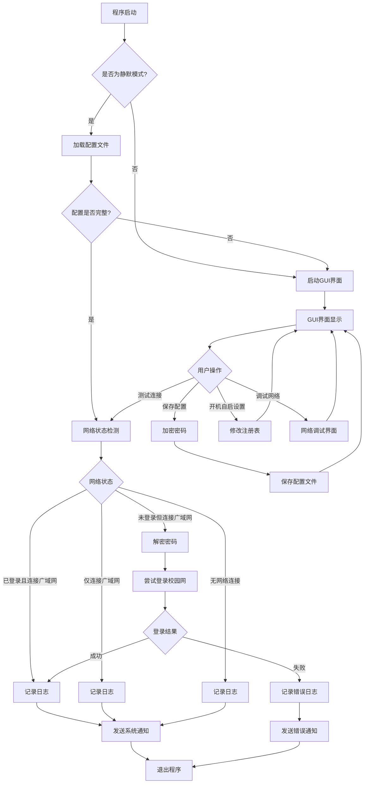
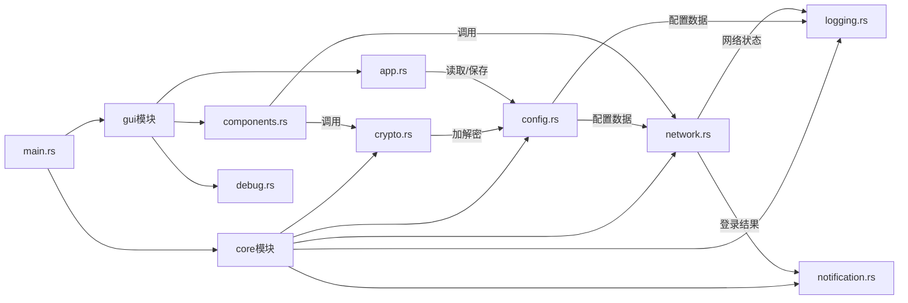
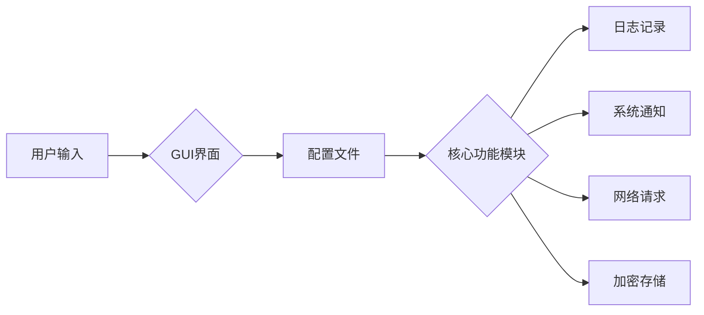

# AutoLoginGUET API 文档

## 1. 项目概述

AutoLoginGUET 是一个使用 Rust 编写的轻量级工具，用于自动登录桂林电子科技大学的校园网络。该工具支持静默登录和图形用户界面配置，可以设置为开机自启。

### 技术架构概览

- **前端框架**: Dioxus v0.5.6
- **异步运行时**: Tokio v1.47.1
- **网络请求**: reqwest v0.12.22
- **加密算法**: aes v0.8.4, sha2 v0.10.9
- **配置格式**: toml v0.9.5
- **日志管理**: chrono v0.4.41, notify-rust v4.11.3
- **操作系统支持**: Windows (使用 winreg v0.52.0 和 winres v0.1.12)

## 2. 项目总览

### 2.1 项目结构说明

```
src/
├── core/              # 核心功能模块
│   ├── config.rs        # 配置定义和基本操作
│   ├── config_manager.rs # 配置管理器
│   ├── crypto.rs        # 密码加密解密
│   ├── logging.rs       # 日志管理
│   ├── mod.rs           # 核心模块导出
│   ├── network.rs       # 网络请求
│   └── notification.rs  # 系统通知
├── gui/               # 图形界面模块
│   ├── app.rs           # 主应用逻辑
│   ├── components.rs    # 界面组件
│   ├── debug.rs         # 调试模块
│   └── mod.rs           # GUI模块导出
└── main.rs              # 程序入口
```

### 2.2 功能流程示意



## 3. 核心模块功能说明

### 3.1 程序入口 main.rs

程序入口文件，负责初始化和协调各模块功能。

主要功能：
- 解析命令行参数（-silent）
- 根据参数决定运行模式（静默模式/图形界面模式）
- 在静默模式下调用 `silent_login` 函数执行登录流程
- 在图形界面模式下调用 `gui::launch_gui` 启动GUI

关键函数：
- `silent_login()` - 静默登录主函数
- `silent_login_with_config()` - 使用配置执行登录
- `set_auto_start()` - 设置开机自启

### 3.2 core 模块

#### 3.2.1 config.rs - 配置管理

负责配置文件的加载、保存和验证。

主要结构体：
- `AccountConfig` - 账户配置（用户名、加密密码、运营商）
- `LoggingConfig` - 日志配置（启用状态、文件路径、保留天数）
- `SettingsConfig` - 设置配置（开机自启）
- `NotificationConfig` - 通知配置
- `ConfigData` - 完整配置数据结构

主要函数：
- `load_config()` - 加载配置
- `save_config()` - 保存配置
- `is_config_complete()` - 验证配置完整性

#### 3.2.2 config_manager.rs - 配置管理器

负责配置的高级管理功能，包括配置的创建、更新和删除等操作。

主要结构体：
- `ConfigManager` - 配置管理器

主要函数：
- `new()` - 创建新的配置管理器实例
- `load()` - 加载配置
- `save()` - 保存配置
- `update()` - 更新配置

#### 3.2.3 crypto.rs - 密码加密解密

负责用户密码的加密和解密操作。

主要函数：
- `encrypt_password()` - 加密密码
- `decrypt_password()` - 解密密码
- `generate_machine_key()` - 生成机器相关密钥
- `get_machine_guid()` - 获取Windows机器GUID

#### 3.2.4 logging.rs - 日志管理

负责日志的记录和管理。

主要结构体：
- `LogManager` - 日志管理器

主要函数：
- `log_event()` - 记录日志事件
- `clean_old_logs()` - 清理旧日志
- `read_logs()` - 读取日志

#### 3.2.5 network.rs - 网络请求

负责网络状态检查和登录请求。

主要结构体：
- `NetworkStatus` - 网络状态枚举
- `NetworkConfig` - 网络配置
- `NetworkManager` - 网络管理器

主要函数：
- `check_campus_network_status()` - 检查校园网状态
- `check_external_connectivity()` - 检查外部网络连接
- `check_network_status()` - 检查网络状态
- `attempt_login_with_credentials()` - 使用凭据尝试登录
- `try_drcom_login()` - DRCOM登录实现

#### 3.2.6 notification.rs - 系统通知

负责系统通知的显示。

主要结构体：
- `NotificationManager` - 通知管理器

主要函数：
- `show()` - 显示通知

### 3.3 gui 模块

#### 3.3.1 app.rs - 主应用逻辑

负责GUI应用程序的主要逻辑和界面交互。

主要结构体：
- `GuiConfig` - GUI配置结构体

主要函数：
- `launch_gui()` - 启动GUI
- `gui_config_to_config_data()` - GUI配置转换为配置数据
- `app()` - 主应用组件

#### 3.3.2 components.rs - 界面组件

负责定义界面的样式和组件。

主要常量：
- `CSS` - CSS样式
- `HTML` - HTML模板

#### 3.3.3 debug.rs - 调试模块

负责调试模式下的网络请求和信息显示。

主要结构体：
- `DebugInfo` - 调试信息

主要函数：
- `perform_debug_login()` - 执行调试登录
- `perform_debug_network_request()` - 执行调试网络请求

## 4. 模块间关系

### 4.1 core 模块与 gui 模块的关系

- GUI模块依赖core模块提供的功能接口
- GUI模块通过调用core模块的函数来执行实际的业务逻辑
- core模块不依赖GUI模块，保持独立性

### 4.2 各 core 子模块间的依赖关系



### 4.3 网络、加密、配置等核心功能的交互方式

1. **配置加载流程**：
   - GUI或主程序调用 `load_config()` 加载配置
   - 配置数据被传递给其他模块使用

2. **登录流程**：
   - 检查网络状态（`NetworkManager::check_network_status()`）
   - 解密密码（`decrypt_password()`）
   - 执行登录请求（`NetworkManager::attempt_login_with_credentials()`）
   - 记录日志（`LogManager::log_event()`）
   - 显示通知（`NotificationManager::show()`）

### 5. 数据流向
## 数据流向

